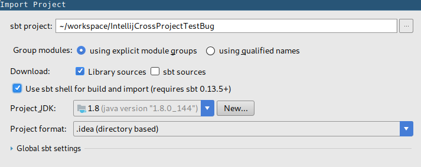
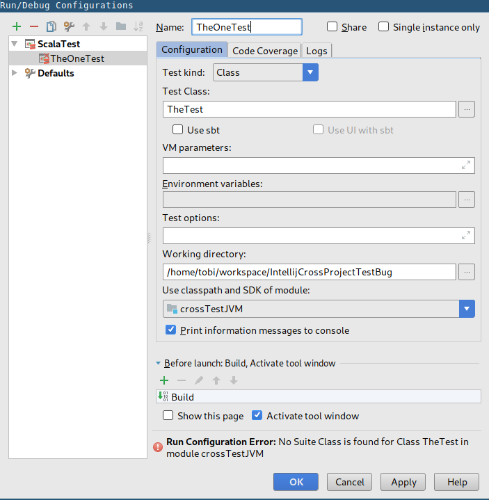

# Intellij CrossProject Test Bug

Intellij does not yet support ScalaJS cross projects very well natively.
However, with `Use sbt shell for build and import` Intellij provides a nice experience even for cross projects with shared files.
One issue, however, is that Intellij will not find shared tests and abort with the message `Run Configuration Error: No Suite Class is found for Class *** in module ***`.
The reason I believe that it is a bug is that it works briefly (about 30sek) after a restart using `Invalidate Caches / Restart`.
After that the above mentioned error message will appear again.
This applies regardless of the type of cross project (i.e. `CrossType.Full` / `CrossType.Pure`)

## Steps to reproduce

I made a repository to show the bug.

1. Clone https://github.com/SrTobi/IntellijCrossProjectTestBug
2. Create a new Project from existing source
    - Select the folder you cloned the repo into
    - Select `sbt` as external project model
3. In the `Import Project` dialog check `Use sbt shell for build and import`

4. Create a new ScalaTest Run/Debug Configuration
    - Test Class: `TheTest`
    - Make sure to select `crossTestJVM` as module under `Use classpath and SDK of module`

(As you can see, the error already appears and it is not possible to use that Run Configuration)

5. Select `File -> Invalidate Caches / Restart`

6. Immediately after the restart press the `Run` button.

The sbt shell will open and start loading the project.
After loading it will compile the source file.
After that Intellij will start the tests as expected and succeed
(Note that `Edit Configurations...` in the Run Select Box is disabled).
After some time (when `Edit Configurations...` is not disabled anymore) Intellij will again not be able to find the class and abort with the exact same error.